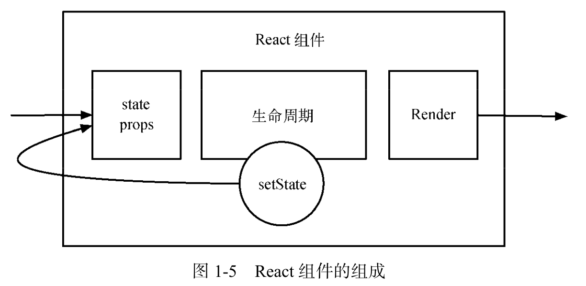
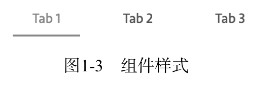

# 1. 初入 React 世界

## 1.1 React简介

 - 是Facebook在2013年开源在 GitHub 上的 JavaScript 库。
 - React 把用户界面抽象成**一个个组件**
 - 开发者通过**组合**这些组件， 最终得到功能丰富、可交互的页面
 - 通过引入 JSX 语法，复用组件变得非常容易，同时也能保证组件结构清晰
 - 可搭配 Flux、Redux、GraphQL/Relay 

### 1.1.2 Virtual DOM
 - 真是页面对应着一个DOM，但DOM操作很昂贵，因此React 把真实 DOM 树转换成 JavaScript 对象树，也 就是 Virtual DOM。
 - 每次数据更新后，重新计算Virtual DOM，并和上一次生成的 Virtual DOM 做对比，对发生 变化的部分做批量更新。
 - 因为使用了Virtual DOM，React也可以和其他平台集成
   - 比如：React-Native是基于Virtual DOM来渲染出app的
   - 因此，React的口号是：*Learn once, Write anywhere*

## 1.2 JSX语法

 - React是通过创建与更新虚拟元素（virtual element）来管理整个VirtualDOM的。
 - 虚拟元素可以理解为正式元素的对应
   - 他的结构与更新都是在内存中完成的，并不会渲染到DOM中去
 - React可创建的虚拟元素可分成两类：
   - DOM元素（DOM Element）
     - 原生DOM元素
   - 组件元素（component element）
     - 自定义元素

### a）DOM元素

 - 如果用HTML表示一个Button：
```html
<button class="btn btn-blue">
  <em>Confirm</em>
</button>
```

 - 如果转换成JSON对象，就会是：
```json
{
  type: 'button',
  props: {
    className: 'btn btn-blue',
    children: [{
      type: 'em',
      props: {
        children: 'Confirm
      }
    }]
  }
}
```

 - 这样，我们可以在javascript中创建VirtualDOM元素了
 - *注意：这些元素并不是真实的实例，只是想表达一个概念！*

### b）组件元素

 - 我们也可以把Button写成一个公共方法：

```js
const Button = ({color, text}) => {
  return {
    type: 'button',
    props: {
      className: 'btn btn-${color}',
      children: {
        type: 'em',
        props: {
          children: text
        }
      }
    }
  }
}
```

 - 我们调用`Button({color: 'blue', text: 'Confirm'})`就可以创建Button了
 - 因为有公共方法，我们就可以让元素彼此嵌套或混合，建出完整的DOM树：
```js
const DangerButton = ({text}) => ({
  type: Button,
  props: {
    color: 'red',
    children: text
  }
})

const DeleteAccount = () => ({
  type: 'div',
  props: {
    children: [{
      type: 'p',
      props: {
        children: 'Are you sure?'
      }
    }, {
      type: DangerButton,         // 这里直接使用DangerButton
      props: {
        children: 'Confirm'
      }
    }, {
      type: Button,
      props: {
        color: 'blue',
        children: 'Cancel'
      }
    }]
  }
})
```

 - *注意：这些元素并不是真实的实例，只是想表达一个概念！*

 - 现实中，我们都是使用Babel的JSX编译器转换JSX到HTML，比如：

```js
var DeleteAccount = function DeleteAccount(){
  return React.createElement(
    'div',
    null,
    React.createElement(
      'p',
      null,
      'Are you sure?'
    ),
    React.createElement(
      DangerButton,
      null,
      'Confirm'
    ),
    React.createElement(
      Button,
      {color: 'blue'},
      'Cancel'
    )
  )
}
```

 - 除了`React.createElement`之外，结构跟之前的都一样
 - 其实JSX并不是强制选项，但是JSX更易与阅读与开发，因此建议使用

### 1.2.2 JSX基本语法

#### 1.2.2(1) XML基本语法

 - (SKIP)

#### 1.2.2(2) 元素类型

 - **小写**首字母对应DOM元素、**大写**首字母对应组件元素。
 - 为了解决**组件相同名称冲突**的问题，JSX还可以通过**命名空间的方式**使用组件元素
   - 另一个好处是可以**对一组组件进行归类**
   - 比如，我们想使用 Material UI 组件库中的组件，**以 MUI 为包名**，可以这么写:

```js
const App = () => (
  <MUI.RaisedButton label="Default" />
);
```

**注解**

 - HTML的注解是`<!--content-->`
 - 在JSX：
   - 如在一个组件的子元素位置使用注解，用`{}`包起来
   - 否者用 `/*...*/`

```js
ReactDOM.render(
    /* 这是正确的注释 */
    <div>
    /* 这是错误的注释!! */
    {/* 这是正确的注释 */}
        <p>{/* 这是正确的注释 */}</p>
    </div>,
    document.getElementById('demo')
);
```

**条件注释**

 - HTML中的：
```html
<!--[if IE]>
  <p>Work in IE browser</p>
<![endif]-->
```

 - JSX中的：
```jsx
{
  (!!window.ActiveXObject || 'ActiveXObject' in window) ? <p>Work in IE browser</p> : '' 
}
```

#### 1.2.2(3) 元素属性

**标签的属性**

 - 无论是DOM元素或组件元素**都有属性**
 - JSX的**DOM元素**的属性跟html的都一样，但有两个例外：
   - [HTML] class -> [JSX] className
   - [HTML] for -> [JSX] htmlFor

```jsx
/* (这是jsx) */

{/*html class属性*/}
<div className="myClass"></div>

{/*html label标签 */}
<label htmlFor="name" class="mayName"></label>
```

 - 而**组件元素**的属性是完全**自己定义**的，也可以理解为实现组件所需要的参数，比如：

```js
const Header = ({title, children}) => ( // 这里就实现组件所需要的参数(title)
  <h3 title={title}>{children}</h3>
);
...
<Header title="hello world">Hello world</Header>
```

**Boolean 属性**
 - 忽略Boolean**属性值**会导致JSX认为bool值设为了True。（注意是**值**）
 - 传达False就一定要使用**表达式**

```jsx
/* 以下两个意义相同 */
<Checkbox checked={true}/>
<Checkbox checked/>

/* 传达False需要表达式 */
<Checkbox checked={false}/>
```

**展开属性**

 - 如果事先知道组件需要的属性，可写为：
 ```js
 const component = <Component name={name} value={value} />;
```

 - 如果不知道设置什么好，可以写为：
```js
const component = <Component />; 
component.props.name = name; 
component.props.value = value;
```

 - 但是，React不能帮你检查属性类型（propTypes），所以这样的写法不建议。
 - 可以考虑使用 ES6 rest/spread 特性来提高效率: 
 
```js
const data = { name: 'foo', value: 'bar' };
const component = <Component name={data.name} value={data.value} />;
```

 - 或，也可以写成:
 ```js
const data = { name: 'foo', value: 'bar' }; 
const component = <Component {...data} />;
```

**自定义 HTML 属性**

 - (SKIPPED)

#### 1.2.2(4) JavaScript属性表达式 
 - **属性值**可以**用表达式表达**，用 {} 替换 "" 即可:
```js
const person = <Person name={window.isLoggedIn ? window.name : ''} />;
```

 - **子组件**也可以作为表达式使用:
```js
const content = <Container>{window.isLoggedIn ? <Nav /> : <Login />}</Container>;
```

#### 1.2.2(5) HTML转义

 - 显示转义字符：
```jsx
<div>版权©</div>        {/* 直接使用UTF-8字符 */}
<div>版权 &copy;</div>  {/* 使用HTML转义字符 */}
<div>版权 &#169;</div>  {/* 十进制的转义字符 */}
```

 - 但是如果在**外面加一层大括号**的话，react为了**防止xss**会**将转义后的字符实体再次转义**
 - 如：`<div>{'版权 &#169;'}</div>` 错误输出 `版权 &#169;`

 - 其他正确的写法：
   - 直接使用UTF-8字符仍然可以正确输出
     - `<div>{'版权 ©'}</div>`
   - 安全的做法是使用对应的Unicode码
     - `<div>{'版权 \u00a9'}</div>`
   - 使用fromCharCode
     - `<div>{'版权 ' + String.fromCharCode(169)}</div>`
   - 使用数组组装
     - `<div>{['版权 ', <span>&#169;</span>]}</div>`
   - 使用dangerouslySetInnerHTML，可以避免React转义字符
     - `<div dangerouslySetInnerHTML={{ __html: '版权 &#169;' }} />`

## 1.3 React组件

### 1.3.1 组件的演变

- 在 MV* 架构出现之前，组件主要分为两种:
   - UI组件：
     - 利用JavaScript或style来操作DOM
     - 可细分到：结构、样式和交互行为，也对应着HTML，CSS和JavaScript(JQuery)
     - 基本上，结构上（HTML）哪里需要变，我们就用CSS或JavaScript(JQuery)操作那里
     - 这个方法的问题是结构、样式与行为没有很好地结合
       - 不同参数下的逻辑可能会导致不同的渲染逻辑
       - 比如，常见的 show、hide 与 toggle 方法就是通过改变class控制style来显示或隐藏
       - 这样的逻辑一旦复杂，就存在大量的 DOM 操作；开发及维护成本相当高。
   - 广义上的组件
     - MVC -> Web Components -> React


### 1.3.2 React组件的构建

 - React组件：
   - 可被描述成JSON对象，因此也意味着可以使用方法或类构建它
   - 基本上由3个部分组成：
     - 属性(props)
     - 状态(state)
     - 生命周期方法
   - React组件可以**接收参数**，也可能有**自身状态**。
     - 一旦接收到的参数或自身状态有所**改变**， React组件就会执行相应的**生命周期方法**，最后渲染。
     - 整个过程完全符合传统组件所定义的组件**职责**



#### 1.3.2(1) React 与 Web Components
  - 也是有差别的
  - （SKIP）

#### 1.3.2(2) React 组件的构建方法
 - 3 种方法：
   - React.createClass
   - ES6 classes 
   - 无状态函数(stateless function)

**React.createClass**

```js
const Button = React.createClass({ 
  getDefaultProps() {
    return {
      color: 'blue', text: 'Confirm',
    }; 
  },
  render() {
    const { color, text } = this.props;
    return (
      <button className={`btn btn-${color}`}>
      <em>{text}</em> </button>
    ); 
  }
});
```
 - 当另一个组件需要调用 Button 组件时，只用写成 `<Button />`即可

**ES6 classes**

 - 通过ES6标准的类语法

```jsx
import React, { Component } from 'react';

class Button extends Component {
  constructor(props) {
    super(props); 
  }
  
  static defaultProps = {
    color: 'blue',
    text: 'Confirm', 6
  };

  render() {
    const { color, text } = this.props;
    return (
      <button className={`btn btn-${color}`}>
        <em>{text}</em>
      </button>
    ); 
  }
}
```

 - 在 React 组件开发中，常用的方式是将组件拆分到合理的粒度，用组合的方式合成业务组件，也就是 HAS-A 的关系。

**无状态函数**

```jsx
function Button({ color = 'blue', text = 'Confirm' }) { 
  return (
    <button className={`btn btn-${color}`}> 
      <em>{text}</em>
    </button> 
  );
}
```

 - 无状态组件**只传入props 和 context**两个参数
   - 也就是说，React组件**不存在state**，也**没有生命周期方法**
   - 内部优化：React创建无状态函数的时候，始终保持了一个实例，避免了不必要的检查和内存分配
  
## 1.4 React 数据流

 - 在 React 中，数据是**自顶向下（top-down）单向**流动的
   - 即从父组件到子组件。
   - 这使得组件之间的关系比较简单且可预测

 - state 与 props 是 React 组件中**最重要的概念**。
   - 如果顶层组件初始化 **props**，那么 React 会向下遍历整棵组件树，重新尝试渲染**所有相关的子组件**。
   - 而 **state** 只关心每个组件自己**内部的状态**， 这些状态**只能在组件内改变**。

### 1.4.1 state

 - 可使用`setState`令该组件**重新渲染**
   - 背后原因：我们改变了内部状态(state)，所以组件需要更新！
 - `setState`是一个**异步**方法
   - 一个生命周期内所有的 setState 方法会合并操作

 - (Skipped activeIndex 在内部更新、activeIndex 在外部更新)

### 1.4.2 props

 - properties的缩写
 - 是React用来让**组件之间互相联系**的一种机制
 - React的单向数据流，主要的**流动管道**就是 props
 - props本身是**不可变的**
   - 当我们试图改变 props 的原始值时，React 会报出类型错 误的警告
   - 组件的props一定来自于默认属性或通过父组件传递而来
   - 如果说要渲染一个对props 加工后的值，最简单的方法就是使用局部变量或直接在 JSX 中计算结果。

 - 一些基本的元素props是：
   - className: 根节点的 class。
     - 为了方便覆盖其原始样式，我们都会在根节点上定义 class
     - 这一点会在 2.3 节中详细说明。
   - classPrefix: class 前缀。
     - 对于组件来说，定义一个统一的 class 前缀，对样式与交互分离起了非常重要的作用。
   - onChange: 回调函数。
     - 当我们切换 tab 时，外组件需要知道组件内部的信息，尤其是当前tab 的索引号的信息。

 - React为props同样提供了默认配置
  - 可通过 defaultProps 静态变量的方式来定义。

```js
static defaultProps = {
  classPrefix: 'tabs',
  onChange: () => {}
}
```
 - 现在我们要建设一个tabs组件，大概是这样：


 - 有两种方法设计这个tabs组件：
   1. 把**所有的子组件展示**出来（如下所示）
       - 这样，又易于理解，又自定义能力强
       - 但是，显得过于笨重

```jsx
<Tabs classPrefix={'tabs'} defaultActiveIndex={0}> 
  <TabNav>
    <TabHead>Tab 1</TabHead>
    <TabHead>Tab 2</TabHead>
    <TabHead>Tab 3</TabHead>
  </TabNav>
  <TabContent>
    <TabPane>第一个 Tab 里的内容</TabPane>
    <TabPane>第二个 Tab 里的内容</TabPane>
    <TabPane>第三个 Tab 里的内容</TabPane>
  </TabContent>
</Tabs>
```

   2. 或者，我们可以只显示定义内容区域的**子组件集合**
     - 把之前的`TabNav`与对应的`TabContent`拼装，形成以下

```jsx
<Tabs classPrefix={'tabs'} defaultActionIndex={0}>
  <TabPane key={0} tab={'Tab 1'}>第一个 Tab 里的内容</TabPane>
  <TabPane key={1} tab={'Tab 2'}>第二个 Tab 里的内容</TabPane>
  <TabPane key={2} tab={'Tab 3'}>第三个 Tab 里的内容</TabPane>
</Tabs>
```
 - 在本章中，我们通过后一种方式讲解，我们需要怎么定义“子组件”？到底怎么对它进行**拼装渲染**呢？

### 1.4.2（1）子组件prop

 - children是其中一个prop，它代表组件的子组件集合。
 - 我们可以用children形成以下的：
```jsx
<Tabs classPrefix={'tabs'} defaultActiveIndex={0} className="tabs-bar" 
  children={[
    <TabPane key={0} tab={'Tab 1'}>第一个 Tab 里的内容</TabPane>,
    <TabPane key={1} tab={'Tab 2'}>第二个 Tab 里的内容</TabPane>,
    <TabPane key={2} tab={'Tab 3'}>第三个 Tab 里的内容</TabPane>,
  ]}
>
</Tabs>
```

 - 渲染TabPane组件的方法如下：

```jsx
getTabPanes(){
  const {classPrefix, activeIndex, panels, isActive } = this.props;
  
  return React.Children.map(panels, (child) => {  // 用这个方法遍历子组件
    if(!child) {return ;}

    const order = parseInt(child.props.order, 10);
    const isActive = activeIndex == order;

    return React.cloneElement(child, {
      classPrefix,
      isActive,
      children: child.props.children,
      key: `tabpane-${order}`,
    })                                  // 最后返回这个 TabPane 组件集合
  })
}
```
 - 通过`React.Children.map`和`React.cloneElement`把isActive, order, key传入到**TabPane**里
 - 其中，`React.Children` 是React官方一系列操作 children 的方法。
   - 它提供诸如 map、 forEach、count 等实用函数，可以为我们处理子组件提供便利。

 - 最后，**TabContent**组件的 `render` 方法只需要调用 `getTabPanes` 方法即可**渲染**:
```jsx
render() {
  return (<div>{this.getTabPanes()}</div>);
}
```

 - 或者，也可以使用**Dynamic Children(动态子组件)**的方式：
```jsx
render() {
  return (<div>{React.Children.map(this.props.children, (child) => {...})}</div>);
}
```
 - 除了数组的 map 函数，我们还可以用其他实用的高阶函数，如 reduce、filter 等函 数
 - 注意：**map**与**forEach**很相似但不返回调用结果的**forEach**不能在这个情况使用。
   - 因为，map()会分配内存空间存储新数组并返回，forEach()不会返回数据。(https://www.jianshu.com/p/6146bf9c614d)


### 1.4.2（*1*）目前的了解

 - 这部分是我自己加的，因为可能读到这里，还是感觉到很迷茫，不知道所有东西怎么拼在一起
 - 主要是参考了 https://blog.csdn.net/weixin_34062329/article/details/93401653

**Tabs类**
```jsx
getTabPanes(){
  const {classPrefix, activeIndex, panels, isActive } = this.props; // TODO: not sure how activeIndex is passed in
  
  return React.Children.map(this.props.children, (child) => {  // 用这个方法遍历子组件
    if(!child) {return ;}

    const order = parseInt(child.props.order, 10);
    const isActive = activeIndex == order;

    return React.cloneElement(child, {
      classPrefix,
      isActive,
      children: child.props.children,
      key: `tabpane-${order}`,
    })                                  // 最后返回这个 TabPane 组件集合
  })
}

getTabContent(){
  return React.Children.map( this.props.children , (child) => {
    if (activeIndex === child.props.order) {     // 只显示isActive的children/content
      return (<div>{child.props.children}</div>)
    }
  });
}

render() {
  return (<div>
    <div>{this.getTabPanes()}</div>
    <div>{this.getTabContent()}</div>
  </div>);
}
```

**TabPane类**
```jsx
const {classPrefix, isActive, children, key, tab } = this.props;

render() {
  return (
    <span>{tab}</span> {/* TODO: Should set up different styles based on isActive and classPrefix. */}
  )
}
```

**调用**
```jsx
<Tabs classPrefix={'tabs'} defaultActiveIndex={0} className="tabs-bar" 
  children={[
    <TabPane key={0} tab={'Tab 1'}>第一个 Tab 里的内容</TabPane>,
    <TabPane key={1} tab={'Tab 2'}>第二个 Tab 里的内容</TabPane>,
    <TabPane key={2} tab={'Tab 3'}>第三个 Tab 里的内容</TabPane>,
  ]}
>
</Tabs>
```

### 1.4.2（2）组件props

 - 目前，我们的**TabPane**是这个样子的：
```jsx
<TabPane key={0} tab={'Tab 1'}>第一个 Tab 里的内容</TabPane>
```
 - 在Tab props，其实我们也可以传入节点的；也被称为**component props**

```jsx
<Tabs classPrefix={'tabs'} defaultActiveIndex={0} className="tabs-bar">
  <TabPane order="0" tab={<span><i className="fa fa-home"></i>&nbsp;Home</span>}>
    第一个 Tab 里的内容
  </TabPane>
  <TabPane order="1" tab={<span><i className="fa fa-book"></i>&nbsp;Library</span>}>
    第二个 Tab 里的内容
  </TabPane>
  <TabPane order="2" tab={<span><i className="fa fa-pencil"></i>&nbsp;Applications</span>}>
    第三个 Tab 里的内容
  </TabPane>
</Tabs>
```

 - 然后TabNav 组件中简化的渲染子组件集合的方法是：

```jsx
getTabs() {
  const { classPrefix, activeIndex, panels } = this.props;

  return React.Children.map(panels, (child) => {
    if (!child) { return; }

    const order = parseInt(child.props.order, 10);

    let classes = classnames({  // TODO: 具体怎么操作？
      [`${classPrefix}-tab`]: true, 
      [`${classPrefix}-active`]: activeIndex === order, 
      [`${classPrefix}-disabled`]: child.props.disabled,
    });
    
    return ( <li>{child.props.tab}</li>);   // 调用tab props的节点
  });
}
```

### 1.4.2（3）用 function prop 与父组件通信


